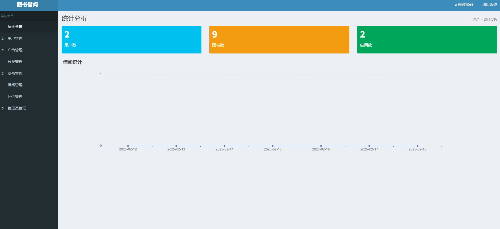
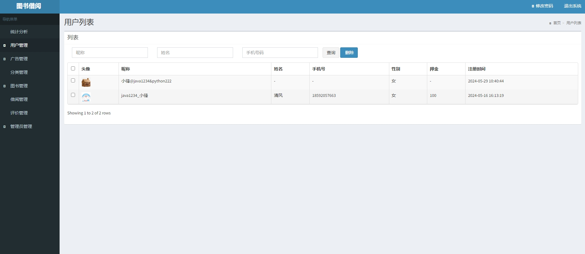
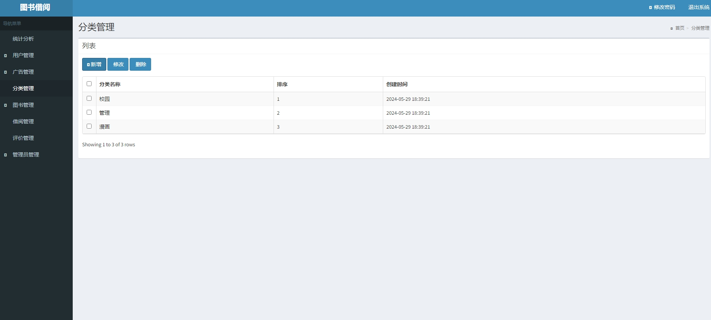
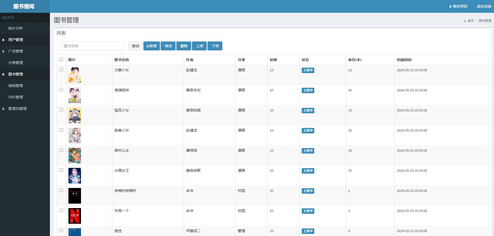
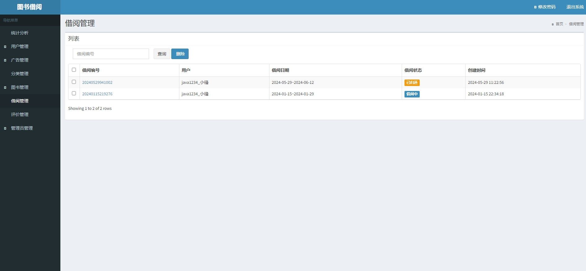
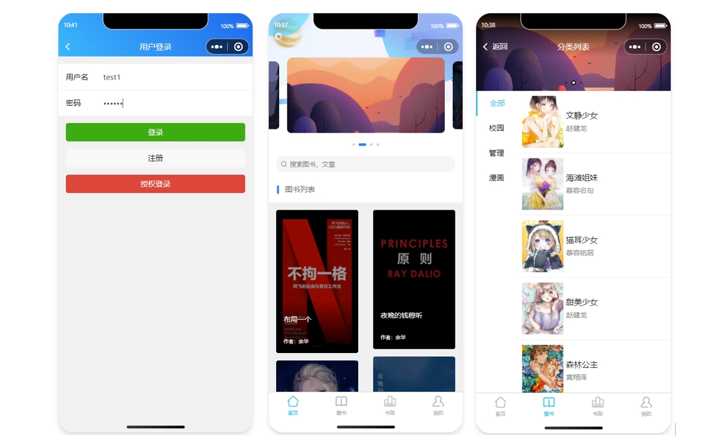
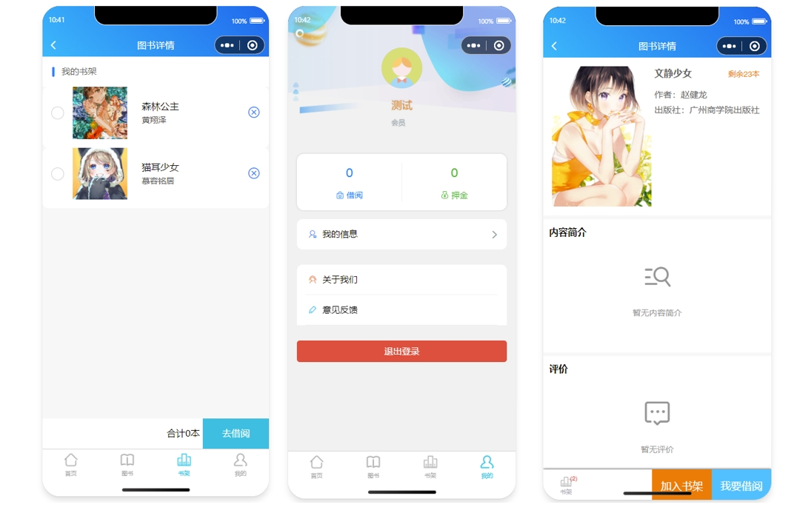
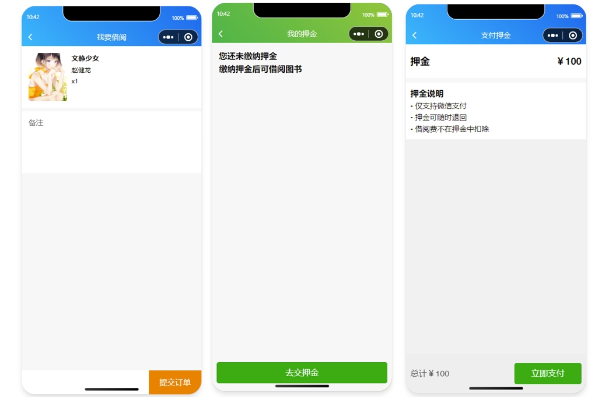
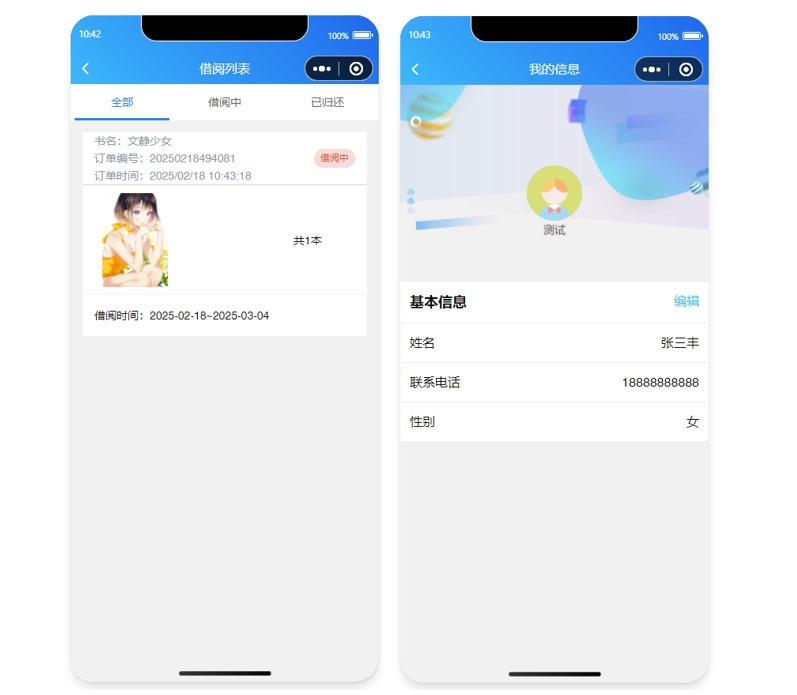
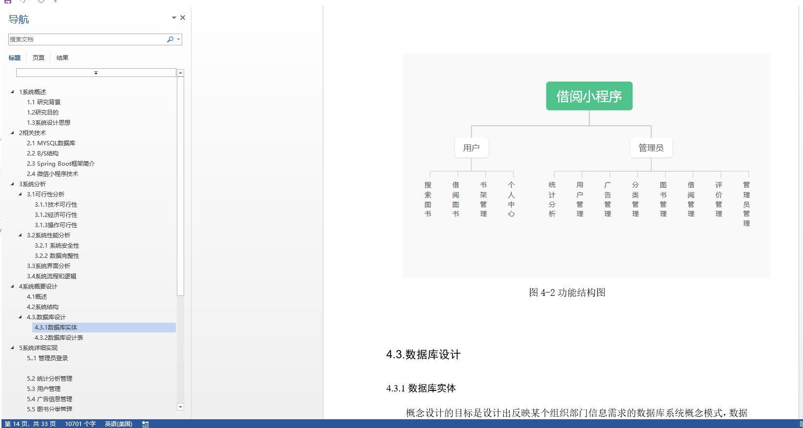

# 1.项目介绍
- 系统角色：管理员、普通用户
- 功能模块：用户管理、广告管理、分类管理、图书管理、借阅管理、评价管理等
- 技术选型：SpringBoot，Vue（后端管理web），原生微信小程序等
- 测试环境：idea2024，jdk1.8，mysql5.7，maven3，微信开发工具
# 2.项目部署
## 2.1 后端部署
- 创建数据库，导入sql文件
- idea打开目录server，根据本地数据库环境修改src/main/resources/application-dev.yml 3-5行 （如果- 你本地数据库是8.0的，注意替换pom里依赖的版本、以及第三行配置serverTimezone，这都是基础，百度遍地都是。）
- 启动项目src/main/java/com/kinnong/BookApplication.java
- http://localhost:8080/ 管理员账号密码：admin/123456， 其他自行查表
## 2.2 小程序部署
- 通过微信开发工具，打开项目mp-weixin
- appid配置为你自己小程序的，或者你自己申请的测试小程序appid
- 信任项目即可，如果页面空白，重新编译下，自行注册登录即可
# 3.项目部分截图

# 4.获取方式
[戳我查看](https://gitee.com/aven999/mall)
